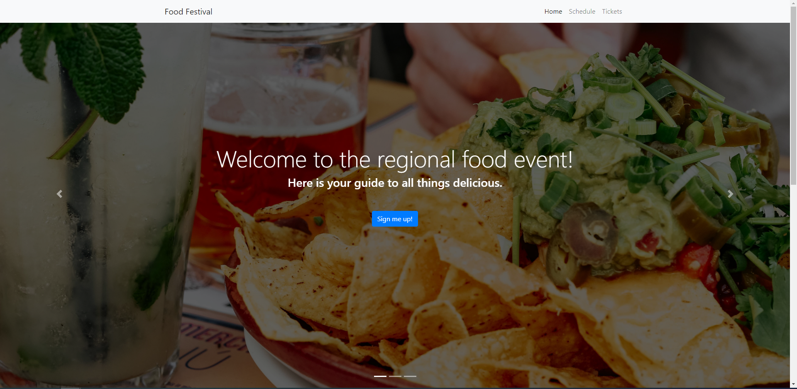

# food-festival

- Github URL: https://github.com/DanielCConlon/food-festival
- Github Pages: https://danielcconlon.github.io/food-festival/

# Goal

Web application designed for a food festival so attendees can use the app on their phones to keep up with everything going on during the festival.

## Table-of-Contents

- [User Story](#userstory)
- [Description](#description)
- [Installation](#installation)
- [Usage](#usage)
- [Application](#application)
- [Questions](#questions)

## [User Story](#table-of-contents)

- AS A manager at an internet retail company
- I WANT a back end for my e-commerce website that uses the latest technologies
- SO THAT my company can compete with other e-commerce companies

## [Description](#table-of-contents)

Web application designed for a food festival so attendees can use the app on their phones to keep up with everything going on during the festival. The application has been optimized by minifying assets, adding offline functionality, and turning it into a Progressive Web Application following a course module on Google Lighthouse, webpack, Service workers and PWAs.

## [Installation](#table-of-contents)

Download the repo from Github. You will also need to run the command npm install express mysql2 in order to get npm and mysql ready.

## [Usage](#table-of-contents)

- Clone the repo
- Open the command line terminal
- Run npm i
- Run npm start
- All good to go

## [Application](#table-of-contents)

## [Questions](#table-of-contents)

To get into contact with me use the follow information below:
 
[Github: DanielCConlon](https://github.com/DanielCConlon)
 
[Email: danielcconlon@gmail.com](danielcconlon@gmail.com)
